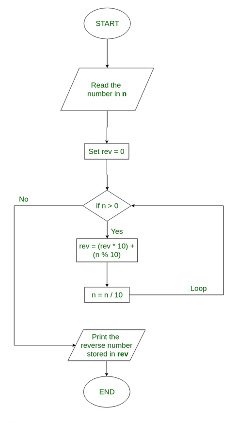
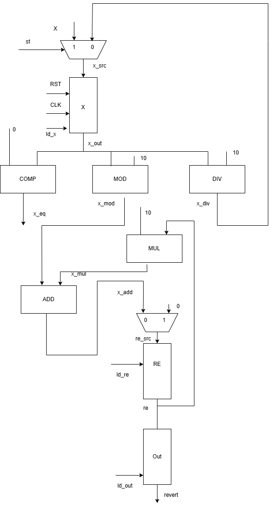
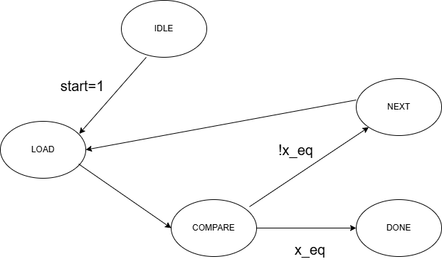

# Reverse_number

## Introduction

This project is simple project about digital design use Verilog hardware description language.

## About the project

### Project sutructure

```plaintext
.
├── hdl/
│   ├── datapath.v
│   ├── controller.v
│   ├── reverse.sv
│   ├── some sub module
├── doc/
│   ├── images/
│   │   ├── datapath.png
│   │   ├── fsm_reverse.png
├── sim/
│   ├── src/
│   │   ├── reverse_tb.sv
│   ├── work/
│   │   ├── file_list.f
│   │   ├── run_batch_tcl
│   │   ├── vm_vm_run.sh
│   │   ├── xlm_waves.tcl
├── inc/
├── README.md

```

### Algorithms



### INOUT signals

| TT  | Port    | Direction | Width  | Meaning                           |
| --- | ------- | --------- | ------ | --------------------------------- |
| 1   | x       | in        | 15 bit | Input signal                      |
| 2   | reverse | out       | 15 bit | Output signal                     |
| 3   | rst_n   | in        | 1 bit  | Reset signal, active at low level |
| 4   | clk     | in        | 1 bit  | Clock pulse                       |
| 5   | Done    | out       | 1 bit  | Complete signal                   |
| 6   | start   | in        | 1 bit  | Begin signal                      |

### Datapath



### FSM



### Verification

I used random the input (x) and assert property to ensure that the result is correct.
