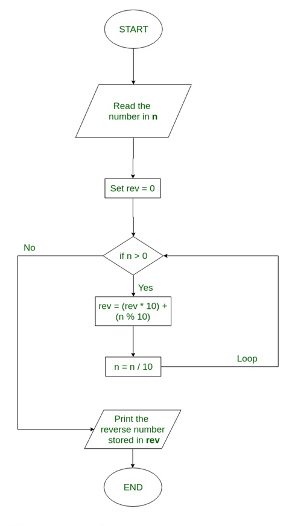
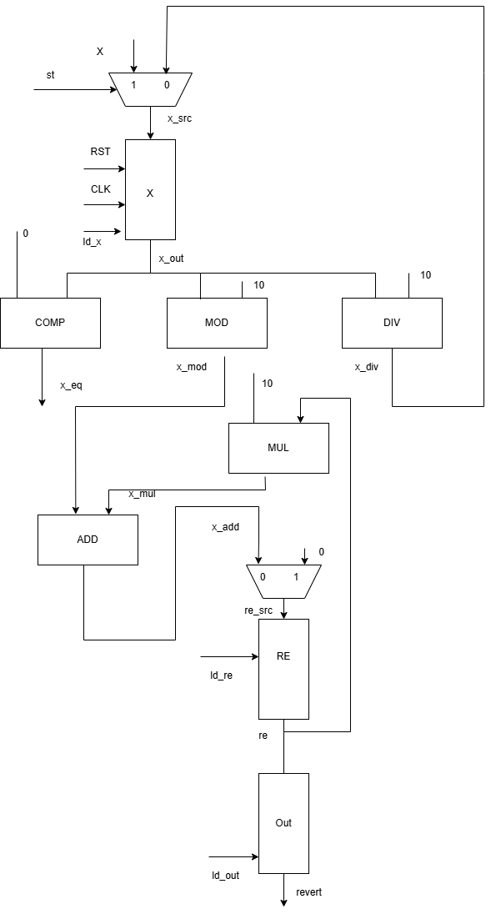
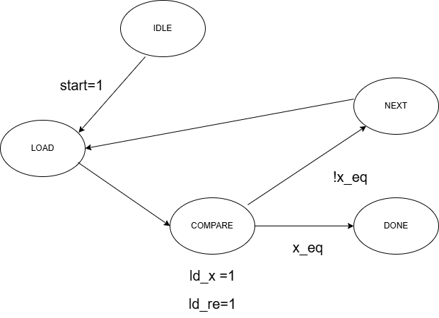

# Reverse_number

## Introduction

This project is simple project about digital design use Verilog hardware description language.

## About the project

### Algorithms

### INOUT signals

| TT  | Port    | Direction | Width  | Meaning                            |
| --- | ------- | --------- | ------ | ---------------------------------- |
| 1   | x       | in        | 15 bit | Input signal                       |
| 2   | reverse | out       | 15 bit | Output signal                      |
| 3   | rst     | in        | 1 bit  | Reset signal, active at high level |
| 4   | clk     | in        | 1 bit  | Clock pulse                        |
| 5   | Done    | out       | 1 bit  | Complete signal                    |
| 6   | start   | in        | 1 bit  | Begin signal                       |

### Datapath

### FSM

